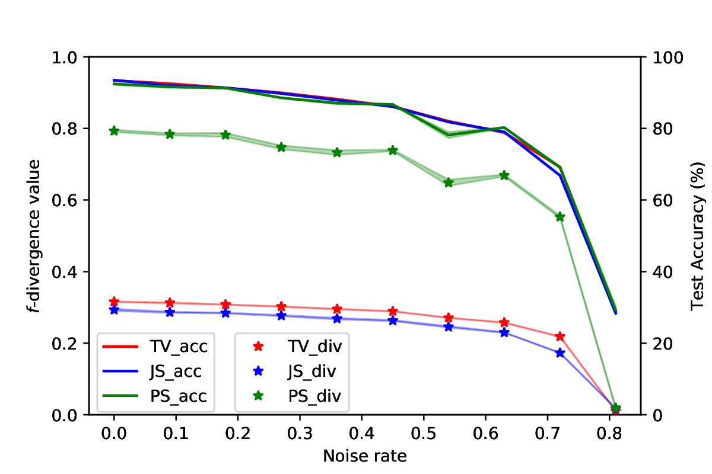

# When Optimizing f-Divergence is Robust with Label noise

This repository is the official Pytorch implementation of "[When Optimizing f-Divergence is Robust with Label noise](https://arxiv.org/abs/2011.03687)" accepted by ICLR2021. 


## Required Packages & Environment
**Supported OS:** Windows, Linux, Mac OS X; Python: 3.6/3.7; 

**Deep Learning Library:** PyTorch (GPU required)

**Required Packages:** Numpy, Pandas, random, sklearn, tqdm, csv, torch (Keras is required if you want to estimate the noise transition matrix).

## Utilities

Details of reproducing our experiment results on MNIST, Fashion MNIST, CIFAR-10, CIFAR-100, Clothing 1M are mentioned in the ``README" file in each folder.

We repeat Figure 1 in our paper here:



## Citation

If you use our code, please cite the following paper:

```
@article{wei2020optimizing,
  title={When Optimizing $ f $-divergence is Robust with Label Noise},
  author={Wei, Jiaheng and Liu, Yang},
  journal={arXiv preprint arXiv:2011.03687},
  year={2020}
}
```

## References
📋 The code about estimating the noise transition matrix is based on **https://github.com/giorgiop/loss-correction**

## Thanks for watching!
